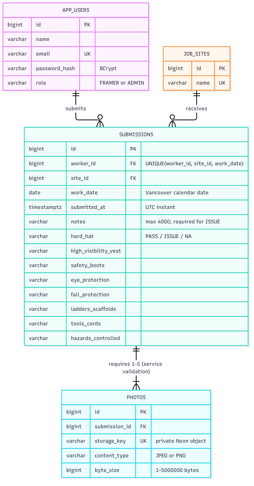

# RAS Site Safety Forms

A mobile React app for framers to submit daily safety checks and photos, with an admin view for worker/site/date filtering and per-site totals.

- **Live app:** https://ras-assessment.onrender.com
- **API health:** https://ras-assessment-api.onrender.com/api/health
- **Repository:** https://github.com/souravC01/RAS-Assesment
- **Pull request:** https://github.com/souravC01/RAS-Assesment/pull/1

The repository is currently private. The candidate plans to make it public before submission; otherwise, grant the evaluator GitHub access. The app is a fictional assessment demo; Submitted means recorded for inspection, not certified safe.

## Stack and routing

React 19 + JavaScript + Vite + React Router; Java 21 + Spring Boot 4.1.1 + Spring Security + JPA + Flyway; Neon PostgreSQL and private S3-compatible object storage.

Render hosts the frontend Static Site and the Docker API Web Service. The frontend rewrites `/api/*` to the API before its SPA fallback. Locally, Vite proxies `/api` to port 8080. This keeps browser requests and session cookies on one origin. The actual hosted rewrite was tested with secure sessions and five 5 MB photos. `render.yaml` reproduces the service settings; the deployed feature branch is `feat/site-safety`, with manual deployment enabled.

## Local setup

Requirements: Java 21, Node 24, Docker, and a private Neon `images` bucket. Maven is included through its wrapper. Use fictional data only.

1. Clone the repository and start PostgreSQL:

   ```powershell
   git clone https://github.com/souravC01/RAS-Assesment.git
   cd RAS-Assesment
   git checkout feat/site-safety
   docker compose up -d
   ```

2. Set demo passwords and storage variables in the backend terminal. `.env.example` documents the names; Spring does **not** automatically load a `.env` file.

   ```powershell
   $env:JAVA_HOME='C:\Program Files\Java\jdk-21' # adjust for your installation
   $env:DEMO_SEED_ENABLED='true'
   $env:DEMO_ADMIN_PASSWORD='YOUR_DEMO_PASSWORD_AT_LEAST_12_CHARACTERS'
   $env:DEMO_FRAMER_A_PASSWORD='YOUR_DEMO_PASSWORD_AT_LEAST_12_CHARACTERS'
   $env:DEMO_FRAMER_B_PASSWORD='YOUR_DEMO_PASSWORD_AT_LEAST_12_CHARACTERS'
   $env:S3_ENDPOINT='YOUR_NEON_STORAGE_ENDPOINT'
   $env:S3_REGION='us-east-2'
   $env:S3_BUCKET='images'
   $env:S3_ACCESS_KEY_ID='YOUR_BRANCH_ACCESS_KEY'
   $env:S3_SECRET_ACCESS_KEY='YOUR_BRANCH_SECRET'
   cd backend
   .\mvnw.cmd spring-boot:run '-Dspring-boot.run.profiles=local'
   ```

   The `local` profile uses PostgreSQL at `localhost:5432`, database `ras`, username `ras`, password `ras-local`. It disables Secure cookies only for local HTTP. Without that profile, set `SPRING_DATASOURCE_URL`, `SPRING_DATASOURCE_USERNAME`, and `SPRING_DATASOURCE_PASSWORD` for a TLS database connection. Schema changes run through Flyway; JPA validates the schema.

3. In another terminal:

   ```powershell
   cd frontend
   npm ci
   npm run dev
   ```

   Open the displayed localhost URL. For macOS/Linux use `./mvnw`, `export` for environment variables, and your installed Java path.

The requested Neon setup is represented by `neon.ts`: its `images` bucket is private. `neon login`, `neon link`, `neon config init`, and `neon deploy` configure a developer's branch. Neon's `AWS_*` variables map to the app's `S3_*` variables above. Credentials belong in ignored local files or provider secrets, never frontend `VITE_*` variables.

## Demo accounts

| Role | Email | Access |
| --- | --- | --- |
| Admin | `admin@example.test` | All submissions, filters, totals, details and photos |
| Framer A | `framer.a@example.test` | Create and view own submissions |
| Framer B | `framer.b@example.test` | Separate account for ownership checks |

Live passwords are supplied separately in the private credential handoff. For local setup, use your environment values. Seeding creates missing accounts/sites and never resets existing passwords. Sites are fictional Cedar Grove, Harbour View, and Maple Court. The hosted demo includes synthetic image fixtures and fictional submissions from two framers across multiple dates/sites.

## Rules and assumptions

- Eight required answers: Pass / Issue / Not applicable; no preselected answers. Issue requires explanatory notes and remains submittable. Notes have a 4,000-character limit.
- Each framer may submit once per job site and work date. A PostgreSQL unique constraint handles concurrent duplicates; another site on the same date is allowed. No edits, public signup, account management, offline mode, charts, or approval/rejection workflow.
- Work dates are `YYYY-MM-DD` calendar values in America/Vancouver, default to today, and cannot be future dates. Submission timestamps are UTC instants. All seeded framers can use all seeded sites.
- Require 1–5 JPEG/PNG photos, each at most **5,000,000 bytes**, with a **26,000,000-byte** multipart request limit. The backend validates actual image contents and caps decoded dimensions at 25 million pixels. Convert HEIC before upload.
- Framers cannot read another framer's details or photo links; these requests return 404. Admin routes require the admin role. Ownership comes from the authenticated session, never a worker ID supplied by the browser.
- BCrypt passwords; active CSRF; HttpOnly/Secure/SameSite=Lax cookies; API responses are no-store. Sessions expire after 30 minutes of inactivity and are lost on API restart. A same-account inline sign-in preserves an in-memory form and its files; writes require explicit retry. Logging out or changing accounts clears prior data/drafts.
- Photos persist in private Neon storage, not Render disk. Authorized signed links last five minutes and remain usable until expiry, including after logout. The app can refresh a link.
- Uploads precede a database transaction; failed uploads, duplicate insertion, and database commit failures trigger object cleanup. Process death or failed cleanup can leave orphan objects; a future lifecycle sweep is the appropriate remedy. This version has no durable background cleanup system.
- A lost response can make write success uncertain. Check history in the offered separate tab before retrying; the draft and photos stay in the original tab. The app never automatically retries a submission. Failed site loading can be retried, and an expired session can be restored inline.
- Render's free API sleeps when idle. The first request can take a few minutes; wait for it to wake, then sign in. The UI shows pending/error states. Restart also invalidates previous sessions.

## Data model



[Diagram source](docs/erd.mmd). Users and job sites each have many submissions; each submission has 1–5 photos, enforced by the service. Database constraints enforce foreign keys, allowed answers, byte sizes, unique photo keys, and the unique worker/site/date combination. All eight answers use the same PASS / ISSUE / NA constraint.

## Verification

```powershell
cd backend
.\mvnw.cmd clean verify
cd ..\frontend
npm ci
npm test
npm run build
```

Docker must run for PostgreSQL Testcontainers. The real storage smoke is opt-in: set `STORAGE_SMOKE=true` and Neon's `AWS_ENDPOINT_URL_S3`, `AWS_REGION`, `AWS_ACCESS_KEY_ID`, `AWS_SECRET_ACCESS_KEY`, then run `mvnw.cmd -Dtest=PhotoStorageTest test`. It creates a random `probe/` JPEG in `images`, checks unsigned denial and identical signed bytes, and deletes it in `finally`. A skipped smoke test is not evidence of working storage.

[Verification evidence](docs/verification.md) covers real PostgreSQL, actual commit rollback, ownership/filters, hosted secure sessions/private photos, maximum-size transport, and real mobile Chrome checks. [Brand provenance](docs/brand.md) records the official logo/color source. [Handoff and interview notes](docs/handoff.md) explain the submission and key tradeoffs. The candidate should understand and be ready to modify the implementation.

The final controlled idle/wake check took about 2 minutes 47 seconds and required a fresh sign-in after the API restarted. [Execution decisions](docs/execution-decisions.md) records scope choices and the three tested review corrections. The confidential assessment PDF is kept locally and excluded from the published branch history.
